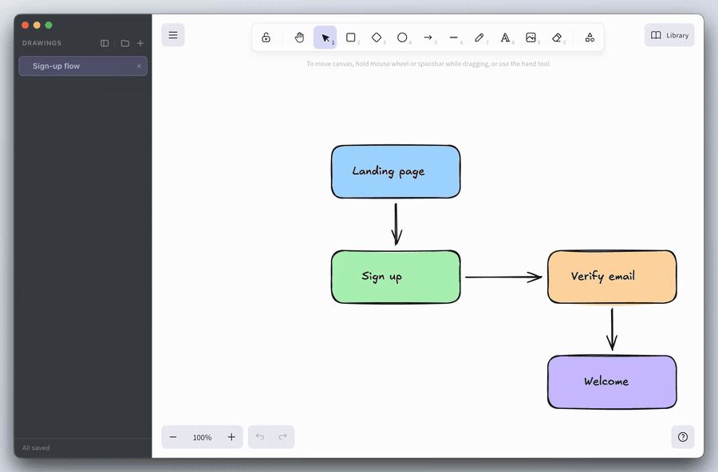

# Excalidraw Desktop

**Double-click your `.excalidraw` files and flip between them in one window.**

A macOS app for working with Excalidraw drawings that live as files on your disk. It runs the same
official [Excalidraw](https://github.com/excalidraw/excalidraw) editor as excalidraw.com, wrapped in a
native window with a sidebar of open drawings.



## Why

excalidraw.com is great for a quick sketch, but it gets awkward once your drawings are files in a
project folder:

- You can't double-click a drawing in Finder and have it open.
- The canvas holds one scene at a time. Opening another file replaces what you were looking at, so
  comparing or jumping between several drawings means juggling browser tabs.

Excalidraw Desktop treats drawings like documents. Double-click one and it opens; double-click
another and it joins the same window as a new tab. Switching is a click or a keystroke away.

## Features

- **Double-click to open.** `.excalidraw` files open straight from Finder. Opening more adds them to
  the window you already have.
- **All your drawings in one sidebar.** Switch with a click or <kbd>⌘1</kbd>–<kbd>⌘9</kbd>. Each
  drawing keeps its zoom level and unsaved edits while you look at another one.
- **Saves back to the original file.** <kbd>⌘S</kbd> writes to the file you opened. Drawings with
  unsaved changes are marked, and the app asks before closing them.
- **Picks up where you left off.** The drawings you had open come back on the next launch.
- **Editable images.** `.excalidraw.png` and `.excalidraw.svg` files (exported with *Embed scene*)
  open for editing and are saved back as images — at the resolution, background and light/dark they
  were exported with.
- **File management in the sidebar.** Right-click a tab to rename it, show it in Finder, or move it
  to the Trash.
- **Shape libraries.** Browse [libraries.excalidraw.com](https://libraries.excalidraw.com) inside
  the app and install with one click. Your library is shared across all drawings.
- **At home on macOS.** A translucent sidebar with adjustable transparency, which you can hide
  with <kbd>⌘B</kbd>.

## Installation

There are no prebuilt downloads yet, so you build the app yourself. You need macOS 13 or later
(what the bundled Electron requires) and [Node.js](https://nodejs.org) 20 or later.

```bash
git clone https://github.com/jheun66/excalidraw-desktop.git
cd excalidraw-desktop
npm install
npm run dist          # Apple Silicon
# npm run dist:intel  # Intel Macs
```

1. Open the `.dmg` that appears in `release/` and drag **Excalidraw Desktop** into
   **Applications**.
2. Launch it once. macOS then knows to open `.excalidraw` files with it.

If another app already opens `.excalidraw` files, select a file in Finder, choose **Get Info**, pick
Excalidraw Desktop under **Open with**, and click **Change All**.

> The app isn't code-signed. A build you made yourself runs as is. If you copy it to another Mac and
> macOS refuses to open it, allow it under **System Settings → Privacy & Security → Open Anyway**.

## Keyboard shortcuts

| Shortcut | Action |
|---|---|
| <kbd>⌘N</kbd> | New drawing (you choose where to save it first) |
| <kbd>⌘O</kbd> | Open drawings (select several at once) |
| <kbd>⌘S</kbd> | Save the current drawing |
| <kbd>⌥⌘S</kbd> | Save all open drawings |
| <kbd>⌘W</kbd> | Close the current drawing |
| <kbd>⌘1</kbd>–<kbd>⌘9</kbd> | Jump to the nth drawing |
| <kbd>⌘B</kbd> | Show or hide the sidebar |

## Supported files

| File | What it is | Saved as |
|---|---|---|
| `.excalidraw`, `.excalidraw.json` | Excalidraw scene | the same file |
| `.excalidraw.png`, `.excalidraw.svg` | Image with the scene embedded in it | the same image format |

`.excalidraw` files open in this app by default. Plain `.png`, `.svg`, and `.json` files are not
taken over — the app only shows up under **Open With** for them — so your other images still open
where they always did. A PNG or SVG exported *without* Embed scene has no scene to edit, so the
app shows a notice instead of opening it.

## Development

```bash
npm install
npm run dev          # Vite dev server + Electron
npm run typecheck
```

Built with [Electron](https://www.electronjs.org), [React](https://react.dev),
[Vite](https://vite.dev), and [`@excalidraw/excalidraw`](https://www.npmjs.com/package/@excalidraw/excalidraw).

How the app is put together, and the pitfalls behind some of its less obvious code, are written up
in [docs/DEVELOPMENT.md](docs/DEVELOPMENT.md).

## Limitations

- **macOS only** for now.
- **No auto-update.** Updates on macOS require a signed app. To update, pull and rebuild:
  `git pull && npm install && npm run dist`.
- **No real-time collaboration.** That needs a server, and this is meant as a personal tool.

## License

[MIT](LICENSE)

Built on [Excalidraw](https://github.com/excalidraw/excalidraw), which is also MIT-licensed.
Excalidraw Desktop is an unofficial project and is not affiliated with the Excalidraw team.
